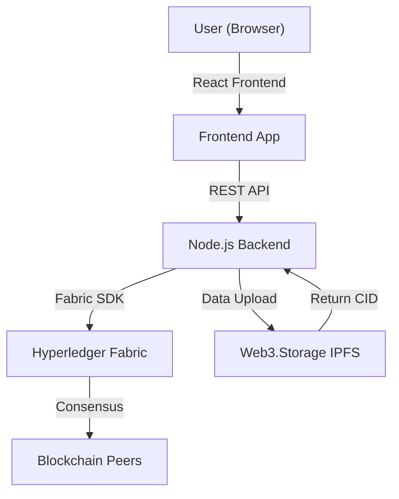
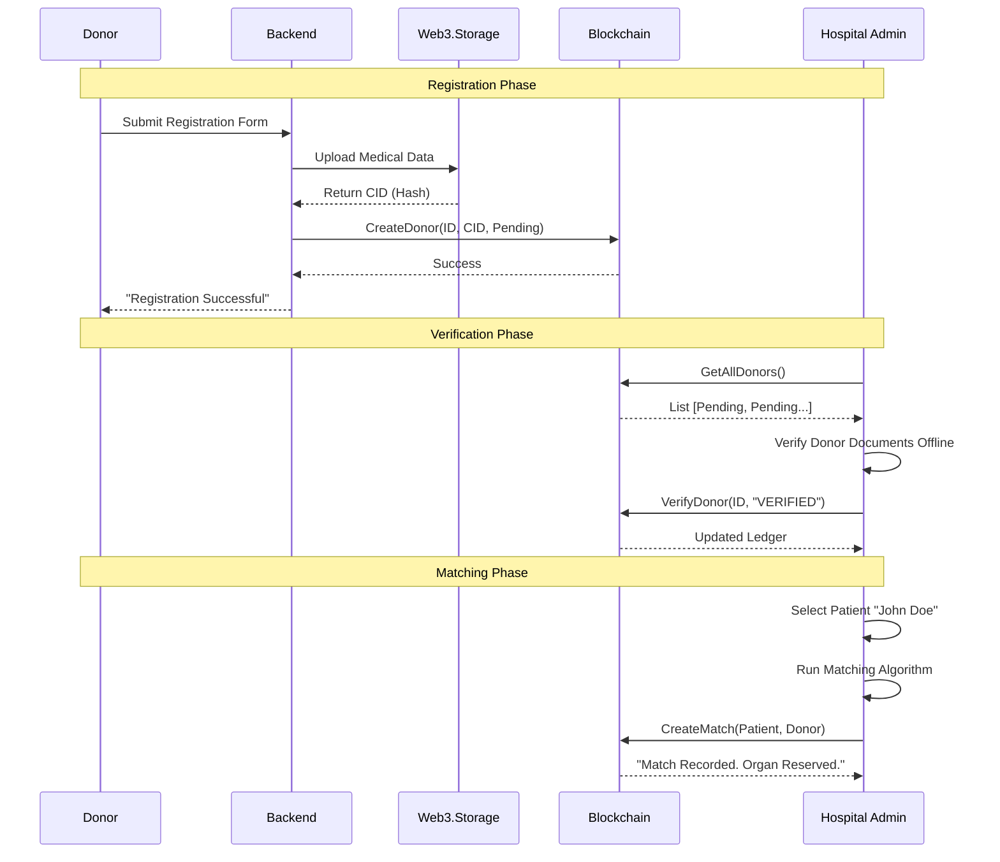

# OrganChain: The Future of Organ Donation
**Comprehensive Technical Report & Project Analysis**

---

## 1. Introduction & Motivation

### 1.1 The Global Crisis
Organ donation is a life-saving process, yet it is plagued by inefficiencies, lack of transparency, and public distrust. In many systems:
*   **Data is siloed**: Hospitals often maintain private waiting lists.
*   **Matchmaking is opaque**: Patients don't know why they were skipped.
*   **Records can be altered**: Legacy databases are vulnerable to tampering and corruption.

### 1.2 The OrganChain Solution
**OrganChain** is a decentralized application (DApp) that solves these problems using **Blockchain Technology**. By moving the registry to a shared, immutable ledger, we ensure that:
1.  **Transparency**: All stakeholders see the same truth.
2.  **Integrity**: Once a record is created, it cannot be faked or deleted.
3.  **Fairness**: The matching algorithms are coded into the system ("Smart Contracts") and executed automatically, removing human bias.

---

## 2. System Architecture

The project follows a **3-Tier Architecture** enhanced with Web3 capabilities.



### 2.1 Frontend Layer (The Experience)
*   **Tech Stack**: React v18, Vite, TailwindCSS.
*   **Role**: Provides the visual interface. It separates concerns into:
    *   **Public Portal**: For donors to register.
    *   **Hospital Portal**: For doctors to verify donors and run matching.
    *   **Dashboard**: Real-time stats on the network state.

### 2.2 Middleware Layer (The Bridge)
*   **Tech Stack**: Node.js, Express.js.
*   **Role**: It acts as a security gateway. Direct blockchain access is complex; the backend simplifies this by:
    *   Handling user authentication.
    *   Managing IPFS uploads (Data Preservation).
    *   Formatting transactions for the Blockchain.

### 2.3 Blockchain Layer (The Trust Anchor)
*   **Platform**: Hyperledger Fabric (Permissioned Blockchain).
*   **Why Fabric?**: Unlike Bitcoin/Ethereum, Fabric is *permissioned*, meaning only authorized entities (Hospitals) can join the network. This ensures medical privacy and regulatory compliance.
*   **Components**:
    *   **Smart Contract (Chaincode)**: Business logic written in **Go**.
    *   **World State**: The current database (CouchDB) of all patients/donors.
    *   **Ledger**: The immutable history of every transaction ever made.

### 2.4 Storage Layer (The Vault)
*   **Platform**: Web3.Storage (Filecoin/IPFS).
*   **Why IPFS?**: Storing large files (medical history, consent forms) on-chain is expensive and slow.
*   **Strategy**: We upload the file to IPFS, get a unique cryptographic fingerprint (**CID**), and store *only* that CID on the blockchain. This guarantees data integrity without bloating the ledger.

---

## 3. Core Features & "Under the Hood" Logic

### 3.1 Feature: Donor Self-Registration
**Problem**: Donors need a way to sign up without visiting a hospital immediately.
**Solution**: A public form that captures data and secures it instantly.

**Technical Flow:**
1.  **Data Capture**: User inputs Name, Blood Type, Organs.
2.  **IPFS Hashing**: Backend strips sensitive info, packages the rest into JSON, and uploads to Web3.Storage.
3.  **Smart Contract**: The `CreateDonor` function is called.
    ```go
    // Chaincode Snippet
    func (s *SmartContract) CreateDonor(ctx contractapi.TransactionContextInterface, ...) {
        // ... validation logic ...
        donor := Donor{
            ID: id,
            VerificationStatus: "PENDING_VERIFICATION", // Default state
            IPFSHash: ipfsHash, // Link to off-chain data
            // ...
        }
        ctx.GetStub().PutState(id, donorJSON)
    }
    ```
4.  **Result**: Donor exists on-chain but is marked `PENDING`.

### 3.2 Feature: Hospital Verification
**Problem**: Anyone can claim to be a donor. False data corrupts the system.
**Solution**: A "Gatekeeper" workflow.

**Technical Flow:**
1.  Hospital Admin (e.g., `HOSP-APOLLO`) logs in.
2.  Admin reviews the PENDING list.
3.  Admin verifies physical ID/Tests offline.
4.  **Transaction**: `VerifyDonor` function is executed.
    ```go
    // Chaincode Snippet
    func (s *SmartContract) VerifyDonor(ctx, id, hospitalId, status) {
        donor, _ := s.GetDonor(ctx, id)
        donor.VerificationStatus = "VERIFIED"
        donor.VerifiedBy = hospitalId
        ctx.GetStub().PutState(id, donorJSON)
    }
    ```

### 3.3 Feature: The Weighted Matching Algorithm 🧠
**Problem**: How do you decide who gets an organ? First-come-first-serve? Best medical match?
**Solution**: A multi-factor weighted algorithm tailored for fairness.

**The Logic (Implemented in Frontend & Verified On-Chain):**
The system calculates a `Total Score (0-100)` for every potential donor-patient pair.

| Factor | Weight | Explanation |
| :--- | :--- | :--- |
| **HLA Compatibility** | **60%** | Genetic matching (Human Leukocyte Antigen). Close matches reduce rejection risk. |
| **Waitlist Priority** | **30%** | 1% per day waiting, capped at 30 days. Prioritizes those waiting longest. |
| **Blood Type Match** | **10%** | Bonus for *exact* match (A+ to A+) vs *compatible* (O- to A+). |

**Safety Check**:
Before any matching happens, the algorithm **MUST** verify:
1.  Donor Status == `VERIFIED`
2.  Organ Available is in `organsAvailable` list.
3.  Blood Types are compatible (`canReceiveFrom` function).

---

## 4. Sequence of Events (The "Story")



---

## 5. Security Measures

1.  **Immutable Logs**: Every "Verify" or "Match" action is a transaction. You can trace *who* verified a donor and *when*.
2.  **Role-Based Access**: The Smart Contract can be programmed to reject `VerifyDonor` calls if the caller isn't a known Hospital ID (MSP).
3.  **Data Privacy**: Sensitive PII (Personally Identifiable Information) can be kept off-chain (on IPFS or private DB), while only the *proof* of existence is on-chain.

---

## 6. Conclusion
OrganChain is not just a database; it is a **Protocol for Trust**. It demonstrates how technology can solve the "Trust Gap" in healthcare. By ensuring that every donation is tracked, every donor is verified, and every match is mathematically fair, we can encourage more people to donate and save more lives.
